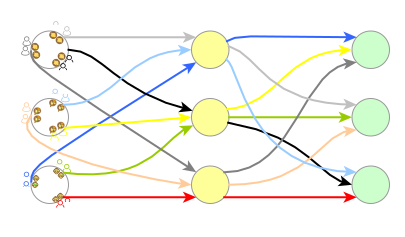

# PRONTO
**Pro**gressive Di**N**ner **T**our **O**ptimizer 
___

## What's a progressive dinner 

A progressive dinner or, more recently, safari supper, is a dinner party with successive courses prepared and eaten at the residences of different hosts. Usually this involves the consumption of one course at each location. [[wikipedia.org/wiki/Progressive_dinner]](https://en.wikipedia.org/wiki/Progressive_dinner)

  

## Precise formulation of the progressive dinner problem

The event involves N couples having each course of a three-course meal at a different person’s house, three couples at each course, every couple hosting once and no two couples meeting more than once. [[arXiv:2001.05394 [math.CO]]](https://doi.org/10.48550/arXiv.2001.05394)
